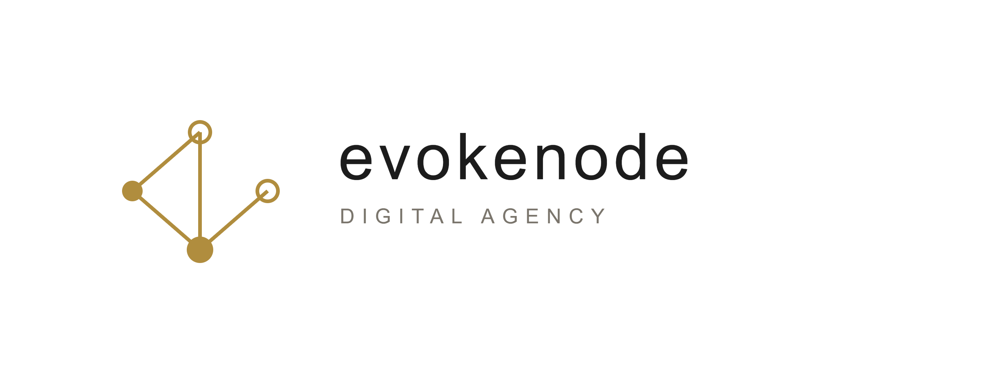

  
   
  

---

### The Problem We Solve
Whether you are a non-technical founder running a tourism company, a researcher analyzing heavy data, or a business owner scaling operations, unreliable software costs you time and money. Off-the-shelf templates break, servers crash under pressure, and poor architecture slows down your growth. 

**EvokeNode eliminates technical friction.** We build, deploy, and manage custom software and cloud infrastructure so you can focus on your goals, not your bugs.

### 🏗️ What We Do
* **Full-Stack Software Development:** End-to-end custom applications tailored for businesses, from dynamic tourism platforms to internal management tools.
* **Cloud Computing & Architecture:** Scalable cloud deployments, secure server management, and infrastructure optimization that keeps your operations online 24/7.
* **Technical Consulting & Research Support:** Advanced problem-solving, data architecture, and custom algorithmic solutions for technical clients, students, and researchers.
* **System Rescue & Diagnostics:** Troubleshooting and fixing broken codebases, slow APIs, and failing server environments.

### 💻 The Tech Stack
We leverage modern, high-performance technologies to ensure your project is built on a rock-solid foundation.
* **Languages & Web:** TypeScript, Python, Rust
* **Infrastructure & Systems:** Cloud Architecture, Linux (Ubuntu Server/Desktop), Bash Automation
* **Networking:** Secure DNS, Encrypted Routing, Web Security

### 📬 Let's Build Something
Ready to solve your technical bottlenecks? 
* **Email:** evokenode@gmail.com
* **Open for:** Freelance contracts, B2B consulting, and custom software development.
